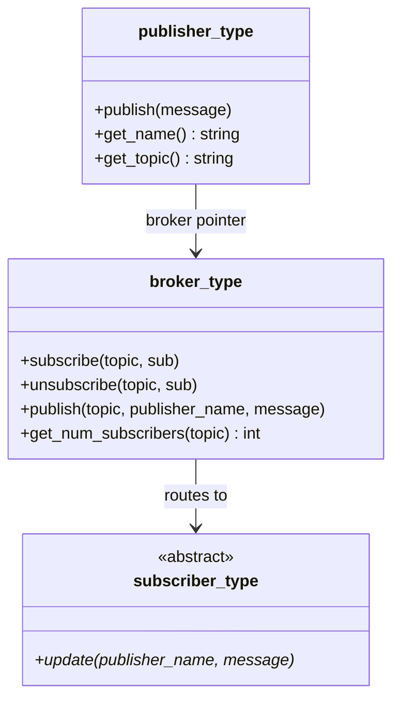

# fortran-publisher-subscriber

A lightweight **Publisher-Broker-Subscriber** pattern implementation in modern Fortran, built with [fpm](https://fpm.fortran-lang.org/).

## Overview

This library provides three core types for event-driven communication:

| Type | Description |
|---|---|
| `broker_type` | Central message broker that manages topic-based subscriptions and routes messages from publishers to subscribers. |
| `publisher_type` | Sends messages to a broker, which routes them to the appropriate subscribers. |
| `subscriber_type` | Abstract base type. Extend it and implement the `update` callback to react to notifications. |

Key features:

- Topic-based message routing via a central broker
- Publishers and subscribers are fully decoupled (no direct references)
- Duplicate subscription prevention
- Dynamic subscriber list with automatic capacity growth
- Explicit cleanup APIs: `broker%clear()` and `pub%disconnect()`
- Simple, clean API

## Class Diagram



## Requirements

- A Fortran compiler supporting Fortran 2008+ submodules (e.g., GFortran 9+, Intel ifx)
- [fpm](https://fpm.fortran-lang.org/) (Fortran Package Manager)

## Installation

### As an fpm dependency

Add to your project's `fpm.toml`:

```toml
[dependencies]
fortran-publisher-subscriber = { git = "https://github.com/kiz0329/fortran-publisher-subscriber.git" }
```

### Build from source

```bash
git clone https://github.com/kiz0329/fortran-publisher-subscriber.git
cd fortran-publisher-subscriber
fpm build
```

## Usage

### 1. Import the module

The library exposes a single entry-point module `pubsub` that re-exports all public types:

```fortran
use pubsub, only: broker_type, publisher_type, subscriber_type
```

### 2. Define a concrete subscriber

Extend the abstract `subscriber_type` and implement the deferred `update` subroutine. The `update` callback receives the publisher's name and a message string:

```fortran
module my_subscriber_m
    use pubsub, only: subscriber_type
    implicit none

    type, extends(subscriber_type) :: my_subscriber
        character(len=64) :: name = ''
    contains
        procedure :: update => my_update
    end type my_subscriber

contains

    subroutine my_update(self, publisher_name, message)
        class(my_subscriber), intent(inout) :: self
        character(len=*), intent(in) :: publisher_name
        character(len=*), intent(in) :: message

        print '(a,a,a,a,a,a)', "[", trim(self%name), &
            "] Received from '", publisher_name, "': ", message
    end subroutine my_update

end module my_subscriber_m
```

### 3. Create a broker, publisher, and manage subscriptions

```fortran
program main
    use pubsub, only: broker_type, publisher_type
    use my_subscriber_m, only: my_subscriber
    implicit none

    type(broker_type), target :: broker
    type(publisher_type) :: news
    type(my_subscriber), target :: sub1, sub2

    ! Initialize subscribers
    sub1%name = "Sub-1"
    sub2%name = "Sub-2"

    ! Create a broker
    broker = broker_type()

    ! Create a publisher linked to the broker with a topic
    news = publisher_type("News Agency", "news", broker)

    ! Subscribe to the "news" topic via the broker
    call broker%subscribe("news", sub1)
    call broker%subscribe("news", sub2)
    print '(a,i0)', "Subscribers: ", broker%get_num_subscribers("news")
    ! Output: Subscribers: 2

    ! Publish a message (routed through the broker)
    call news%publish("Breaking news!")
    ! Output:
    !   [Sub-1] Received from 'News Agency': Breaking news!
    !   [Sub-2] Received from 'News Agency': Breaking news!

    ! Unsubscribe via the broker
    call broker%unsubscribe("news", sub1)
    print '(a,i0)', "Subscribers: ", broker%get_num_subscribers("news")
    ! Output: Subscribers: 1

    ! Only remaining subscribers are notified
    call news%publish("More news!")
    ! Output:
    !   [Sub-2] Received from 'News Agency': More news!

end program main
```

> **Note:** Subscriber variables passed to `broker%subscribe` and `broker%unsubscribe` must have the `target` attribute, since the broker stores pointers to them internally. The broker variable must also have the `target` attribute, as the publisher stores a pointer to it.
>
> **Lifecycle requirement:** Subscribers must remain alive while registered in a broker, and a broker must remain alive while connected publishers still reference it. For explicit teardown, call `broker%clear()` before destroying a broker and `pub%disconnect()` before destroying or reusing a publisher.

## API Reference

### `broker_type`

#### Constructor

```fortran
type(broker_type), target :: broker
broker = broker_type()
```

#### Methods

| Method | Signature | Description |
|---|---|---|
| `subscribe` | `call broker%subscribe(topic, sub)` | Subscribe `sub` to `topic`. Duplicates are silently ignored. The topic is created automatically if it does not exist. |
| `unsubscribe` | `call broker%unsubscribe(topic, sub)` | Unsubscribe `sub` from `topic`. No-op if not subscribed. |
| `publish` | `call broker%publish(topic, publisher_name, message)` | Send `message` to all subscribers of `topic` via their `update` callback. |
| `clear` | `call broker%clear()` | Detach all registered subscribers and remove all topics from the broker. |
| `get_num_subscribers` | `n = broker%get_num_subscribers(topic)` | Returns the number of subscribers for `topic` (pure). Returns 0 if the topic does not exist. |

### `publisher_type`

#### Constructor

```fortran
type(publisher_type) :: pub
pub = publisher_type(name, topic, broker)
```

| Argument | Type | Intent | Description |
|---|---|---|---|
| `name` | `character(len=*)` | `in` | Name identifying this publisher. |
| `topic` | `character(len=*)` | `in` | Topic this publisher sends messages to. |
| `broker` | `type(broker_type), target` | `inout` | The broker to route messages through. |

#### Methods

| Method | Signature | Description |
|---|---|---|
| `publish` | `call pub%publish(message)` | Publish `message` through the broker to all subscribers of this publisher's topic. |
| `disconnect` | `call pub%disconnect()` | Detach the publisher from its broker. Subsequent `publish` calls become no-ops until reconnected via reconstruction. |
| `get_name` | `name = pub%get_name()` | Returns the publisher's name (pure). |
| `get_topic` | `topic = pub%get_topic()` | Returns the publisher's topic (pure). |

### `subscriber_type` (abstract)

Extend this type and implement the deferred procedure:

```fortran
subroutine update(self, publisher_name, message)
    class(my_subscriber), intent(inout) :: self
    character(len=*), intent(in) :: publisher_name  ! name of the notifying publisher
    character(len=*), intent(in) :: message          ! the notification payload
end subroutine
```

## Running the Example

```bash
fpm run --example example_pubsub
```

## Running Tests

```bash
fpm test
```

## License

MIT License. See [LICENSE](LICENSE) for details.